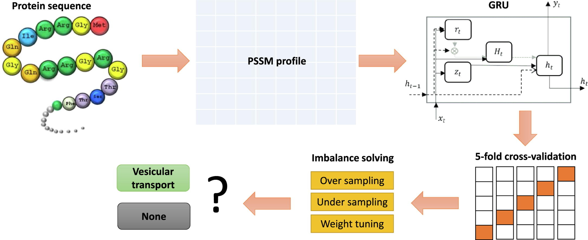

# Computational identification of vesicular transport proteins from sequences using deep gated recurrent units architecture

Protein function prediction is one of the most well-studied topics, attracting attention from countless researchers in the field of computational biology. Implementing deep neural networks that help improve the prediction of protein function, however, is still a major challenge. In this research, we suggested a new strategy that includes gated recurrent units and position-specific scoring matrix profiles to predict vesicular transportation proteins, a biological function of great importance. Although it is difficult to discover its function, our model is able to achieve accuracies of 82.3% and 85.8% in the cross-validation and independent dataset, respectively. We also solve the problem of imbalance in the dataset via tuning class weight in the deep learning model. The results generated showed sensitivity, specificity, MCC, and AUC to have values of 79.2%, 82.9%, 0.52, and 0.861, respectively. Our strategy shows superiority in results on the same dataset against all other state-of-the-art algorithms. In our suggested research, we have suggested a technique for the discovery of more proteins, particularly proteins connected with vesicular transport. In addition, our accomplishment could encourage the use of gated recurrent units architecture in protein function prediction.

Please cite our paper as:
>Le, N.Q.K., Yapp, E.K.Y., Nagasundaram, N., Chua, M.C.H., & Yeh, H.Y. (2019). Computational identification of vesicular transport proteins from sequences using deep gated recurrent units architecture. *Computational and Structural Biotechnology Journal*, 17, 1245-1254. https://doi.org/10.1016/j.csbj.2019.09.005
